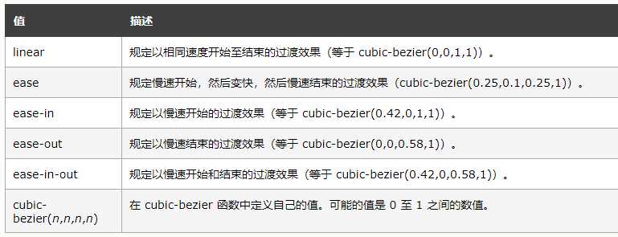
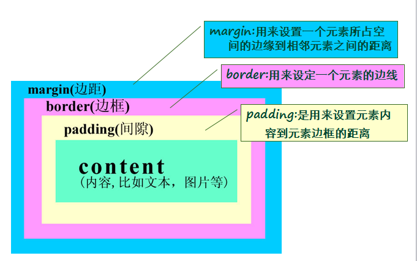

# 基础
## 引入
### 行内式
```html
<div  style="color: cornflowerblue;">
```
### 嵌入式
```css
<style>
 .header{
	 color:red; 
	 font-size: 28px;
 }
</style>
```

### 链接式
```html
<!-- 链接式 -->
<link href="css/base.css" rel="stylesheet" />
```

### 导入式
```html
 <!-- 导入式 -->
 <style>
	 @import url("css/base.css");
 </style>
```

导入式和链接式的区别
- 使用链接式时，会在装载页面主体部分之前装载CSS文件
- 使用导入式时，要在整个页面装载完之后再装载CSS文件
- import把CSS文件的内容复制到HTML文件中，link直接向CSS文件读取所定义的CSS样式

## 选择器分类
### 标记选择器
```css
body{
	margin: 0;
	padding: 0;
	background-color: aqua;
}
```
### 类选择器
```css
.header{
	 color:red;
	 font-size: 28px;
 }
```
### id选择器
```css
#myspan
 {
	 color:red;
	 font-size: 28px;
 }
```
### 伪类选择器
```css
a:link {color: #FF0000}	/* 未访问的链接 */
a:visited {color: #00FF00}/* 已访问的链接 */
a:hover {color: #FF00FF}/* 鼠标移动到链接上 */
a:active {color: #0000FF}/* 选定的链接 */
```

## 层叠性
### 优先级

- 行内样式 > ID选择器 > 类选择器 > 标记选择器

进化:

- !important> 行内样式 > ID选择器 > 类选择器 > 标记选择器
```css
.stack{
	 color:skyblue !important;
 }
```

## 继承性
* 继承性：指子元素会继承父元素定义的某些样式
```html
<!-- 样式继承 -->
 <div class="inher">
	我是继承性-他爸
	<div >
		我是继承性-他儿子
	</div>
</div>
```

也不是所有属性都有继承性:
```css
所有盒子属性 
border, margin,padding
布局属性:float,display, position等 
```

## 选择器
### 交集选择器
示例:
```css
div.two{
		
}
```
- 第一个必须是**标记选择器**
- 第二个必须是**类选择器**或**id选择器**
- 中间不能有空格

### 并集选择器
示例:
```css
 span, #union ,.union{
   color: #FF00FF;
}
```
- 就是对多个选择器进行集体声明，多个选择器之间用**,(逗号)**隔开

通配符 ```*```

### 后代选择器
示例:
```css
.gen span{
   color: chocolate;
}
```
- 选择了 后代, 但**不包括自己**
- 选择作为指定元素后代的元素。
- 指定元素和其后代元素间用**空格隔开**

### 总结
- 标签名+[类名或id名] 为交集选择器 :```div.span``` (div下所有.span的元素,包括div本身)
- 标签名,id名,类名 为并集选择器:```span, #union ,.union```(选择所有符合条件的元素)
- [类名或id名] [标签|类名|id名]为后代选择器 :```.gen span``` (选择类中符合的元素,不包括父类)
 
### 复合选择器
- 复合选择器的优先级比组成它的单个选择器的优先级都要高。
- 优先级权重：ID选择器=100，类选择器=10，标记选择器=1
- 当权重值一样时，会采用“层叠原则”，一般后定义的会被应用 
 示例:
```css
h1{color:red;}	/* 权重=1 */
p em{color:blue;}/* 权重=2 */
p.note em.dark{color:gray;} /* 权重=22 */
#main{color:black;} /* 权重=100 */
```

### 关系选择器
#### 子选择器
用于选中元素的直接后代（即儿子），它的定义符号是大于号（**```>```**）
示例:
```css
.sub ul>li{
	color:#0000FF
}
<!-- .sub下 ul 下 li 下的span -->
.sub ul>li>span{
	color:#D2691E;
}
```
 
### 属性选择器
**匹配HTML属性**
示例:
```css
/* 具有name属性的a元素 */
a[name]{
	color: #008000;
}
/*具有 special 属性的任意元素*/
[special]{
	color:#FF0000
}
```
**匹配属性和值**
示例:
```css
a[name=hyper]{
	color:#00FF00
}
```
 
### 伪类选择器
示例:
```css
a:link {color:gray;} 		/* 未访问的链接 */
a:visited {color:#ccc;} 	/* 已访问的链接 */
a:hover {color:#900;} 		/* 鼠标划过链接 */
a:active {color:red;} 		/* 已选中的链接 */
```

**```:first-child```**
- ```:first-child```伪类用于匹配它的父元素的第一个子元素，
- 即：这个元素是它父元素的第一个儿子，而不管它的父元素是哪个。

```css
p:first-child{	font-weight: bold;	}
```
- 如果p 在父元素中是第一个元素 则应用样式

**过渡(transition)**
- hover伪类能实现瞬间改变颜色等动态效果，但无法实现逐渐平滑改变。
- 可见动态伪类没有中间状态，过渡(transition)就是让一个属性在两种状态之间平滑改变的动画。

```css
.tran{
	 transition:all 1s;  /**在input中增加过度**/
	 border: 1px solid red;
}
/**触发器**/
.tran:focus{
	height:50px;
	border: 1px solid red;
}
/**触发器**/
.tran:hover{
	height:20px;
	border: 1px solid red;
}
```
```html
<input class="tran"/>
```

 
```transition```属性的取值可以为4,3,2个，含义如下
- transition: color .5s ease-in .1s; /*作用属性 持续时间 速度变化 延迟*/
- transition: color .5s .1s;				/*作用属性 持续时间 延迟*/
- transition: color .5s;		 	/*作用属性 持续时间*/
 
 


### 伪元素选择器
**```::before```和 ```::after```**

在元素内部的左右两侧产生两个伪元素
- 行级元素 为首尾
- 块级元素 为上下
- 必须配合 content
```css
/* before after */
p::before{
	content: "-版权-";
	color:red
}
p::after{
	content: "-版权-";
	color:red
}
```

# 练习
自己建一个css文件，完成下列样式的定义
使用 ul li 标签 创建 菜单,完成 鼠标滑过变色

# 盒子模型
## 基本信息


- margin 外边距
- border 边框
- padding 间隙(内边)
- content 内容

简称:1m 2b 3p 4c(外到内)

**属性值:**
- margin: 6px 0 4px 8px
- pading:5px;

**规律:**顺时针方向  : 上 右 下 左
- 如果提供两个，第一个用于上－下，第二个用于左－右。
- 如果提供三个，第一个用于上，第二个用于左－右，第三个用于下。

## 圆角
```css
border-radius: 10px; 
```
## margin

**居中** 常用
```css
/* 一般用于居中 */
margin:0   auto;
```

## 行内元素 和块级元素
- 行内元素和块级元素的区别：
- 行内元素：　　
	* 与其他行内元素并排
	* 不能设置宽高，默认的宽度就是文字的宽度

- 块级元素：
	* 霸占一行，不能与其他任何元素并列。
	* 能接受宽高，如果不设置宽度，那么宽度将默认变为父级的100%。

- 块级元素和行内元素的分类：
- 在HTML的角度来讲，标签分为：
	* 文本级标签：p , span , a , b , i , u , em
	* 容器级标签：div , h系列 , li , dt ,dd
	* p：里面只能放文字和图片和表单元素，p里面不能放h和ul，也不能放p。
- 从CSS的角度讲，CSS的分类和上面的很像，就p不一样：
	* 行内元素：除了p之外，所有的文本级标签，都是行内元素。p是个文本级标签，但是是个块级元素。
	* 块级元素：所有的容器级标签，都是块级元素，以及p标签

- 块级元素和行内元素的相互转换：
- display属性将块级元素(比如div)和行内元素进行相互转换
	* : block; 以块级元素显示
	* : inline;以行内元素显示 高度，行高以及底边距不可改变，高度就是内容文字或者图片的宽度，不可以改变。
	* : inline-block; 以行内块元素显示，行内块元素将在一行内水平排列，但每个元素又具有块级元素的特点(宽高可以改变) 
	* : display: none;  -将元素隐藏，且不占据网页空间

# 相对定位
	position: relative | absolute | fixed | static
- 相对定位（relative）
- 绝对定位（absolute）
- 固定定位（fixed）	

**偏移属性**

top、left、bottom、right

偏移属性仅对设置了**定位属性**的元素有效

**相对定位（relative）**
- 相对于它原来的位置偏移指定的距离
- 就算元素被偏移了，但是他仍然占据着它没偏移前的空间
- 元素宽度自动收缩
- 没有脱离标准流

**绝对定位（absolute）**
- 绝对定位的元素从标准流中脱离
- 浮动出来了
- 子元素使用absolute进行定位的时候，会一层一层地向上去找自己的父元素中
- 有 没有设置position属性的父元素,如果没有找到 ,则相对于文档body来定位
### 快捷

# Flex布局
## 基本
	display: flex;
 
- Flex布局的元素，称为Flex容器（flex container），简称“容器”
- 所有子元素自动成为容器成员，成为flex项目（flex item），简称“项目”。
- 设为flex布局以后，子元素的float、clear和vertical-align属性将失效


## 容器的属性

以下6个属性设置在容器上。

- flex-direction 	属性决定主轴的方向
- flex-wrap			属性是否换行
- flex-flow    		盒子内的元素横轴方向排列 
- justify-content  	水平居中
- align-items   	垂直居中
- align-content
### flex-direction属性
属性决定主轴的方向（即项目的排列方向）。
```css
.box{
     flex-direction:row | row-reverse |  column | column-reverse; 
}
```
- row（默认值）：主轴为水平方向，起点在左端
- row-reverse:主轴为水平方向，起点在右端
- column:主轴为垂直方向，起点在上沿
- column-reverse:主轴为垂直方向，起点在下沿

### flex-wrap
flex-wrap属性定义，如果一条轴线 排不下，如何换行？
```css
.box{
  flex-wrap: nowrap | wrap | wrap-reverse;
}
```
- nowrap（默认）：不换行
- wrap:换行，第一行在上方
- wrap-reverse:换行，在第一行的下方
### flex-flow
flex-flow属性是flex-direction属性和flex-wrap属性的简写形式，**默认 row nowrap**。
```css
.box{
    flex-flow:<flex-direction> || <flex-wrap>;
}
```
### justify-content
justify-content属性定义了项目在主轴上的对齐方式
```css
.box{
    justify-content:flex-start | flex-end | center | space-between |space-around;
}
```

它可能取5个值，具体对齐方式与轴的方向有关。下面假设主轴为从左到右。

- flex-start（默认值）：左对齐
- flex-end：右对齐
- center：居中
- space-between:两端对齐，项目之间的间隔都相等
- space-around：每个项目两侧的间隔相等。所以，项目之间的间隔比项目与边框的间隔大一倍。

### align-items
align-items属性定义项目在交叉轴上如何对齐。
```css
.box{
    align-items:flex-start | flex-end | center |baseline | stretch;
}
```
它可能取5个值。具体的对齐方式与交叉轴的方向有关，下面假设交叉轴从上之下。

- flex-start：交叉轴的起点对齐
- flex-end:交叉轴的终点对齐
- center：交叉轴的中点对齐
- baseline：项目的第一行文字的基线对齐。
- stretch（默认值）：如果项目未设置高度或设为auto，将占满整个容器的高度。

### align-content
align-content属性定义了多根轴线的对齐方式。如果项目只有一根轴线，该属性不起作用。
```css
.box{
    align-content:flex-start | flex-end | center | spance-between | space-around |stretch;
}
```
该属性可能取6个值。

- flex-start：与交叉轴的起点对齐。
- flex-end：与交叉轴的终点对齐。
- center：与交叉轴的中点对齐。
- space-between：与交叉轴两端对齐，轴线之间的间隔平均分布。
- space-around：每根轴线两侧的间隔都相等。所以，轴线之间的间隔比轴线与边框的间隔大一倍。
- stretch（默认值）：轴线占满整个交叉轴。

## 项目属性
以下6个属性设置在容器上。
- order
- flex-grow
- flex-shrink
- flex-basis
- flex
- align-self

### order属性
order属性定义项目的排列顺序。数值越小，排列越靠前，默认为0.
```css
.item{
    order:<integer>;
}
```
### flex-grow属性
flex-grow属性定义项目的放大比例，默认值为0，即如果存在剩余空间，也不放大。
```css
.item{
    flex-grow:<number>;/* default 0*/
}
```
- 如果所有项目的flex-grow属性都为1，则它们将等分剩余空间（如果有的话）。
- 如果一个项目的flex-grow属性为2，其他项目为1，则牵着占据的剩余空间将比其他项多一倍

### flex-shrink
flex-shrink属性定义了项目的缩小比例，默认为1，即如果空间不足，改项目将缩小。
```css
.item{
    flex-shrink:<number>;/* default 1 */
}
```
如果一个项目的flex-shrink属性为0，其他项目都为1，则空间不足时，前者**不**缩小(shrink:0 的项目不缩小)。
### flex-basis
flex-basis属性定义了在分配多余空间之前，项目占据的主轴空间（main size）。浏览器根据这个属性，计算主轴是否有多余空间。
它的默认值为auto，即项目的本来大小。
```css
.item{
    flex-basis:<length> | auto ; /*default auto*/
}
```
它可以设为跟width或height属性一样的值（比如350px），则项目将占据固定空间。
### flex
flex属性是flex-grow，flex-shrink和flex-basis的简写，默认值为0 1 auto。后面两个属性可选
```css
.item {
  flex: none | [ <'flex-grow'> <'flex-shrink'>? || <'flex-basis'> ]
}
```

改属性有两个快捷值：auto（1 1 auto）和none（0 0 auto）.

建议优先使用这个属性，而不是单独写三个分离的属性，因为浏览器会推算相关值

### align-self
- align-self属性允许单个项目有与其他项目不一样的对齐方式，可覆盖align-items属性。
- 默认值为auto，
- 表示继承父元素的align-items属性，如果没有父元素，等同于stretch。
```css
.item {
  align-self: auto | flex-start | flex-end | center | baseline | stretch;
}
```

该属性可能取6个值，除了auto，其他都与align-items属性完全一致。


# 适配 
## meta-viewport
```html
<meta name="viewport" content="width=device-width,initial-scale=1,minimum-scale=1,maximum-scale=1,user-scalable=no" />
```
- width=device-width：宽度等于当前设备的宽度
- height = device-height：高度等于当前设备的高度
- initial-scale=1表示相对于可见视口进行缩放，初始缩放比例是1 
- minimum-scale：允许用户缩放到的最小比例（默认设置为1.0）    
- maximum-scale：允许用户缩放到的最大比例（默认设置为1.0）   
- user-scalable：用户是否可以手动缩放（默认设置为no，因为我们不希望用户放大缩小页面） 
- 
 ## 兼容文件
因为IE8既不支持HTML5也不支持CSS3 Media，所以我们需要加载两个JS文件，来保证我们的代码实现兼容效果：
```html
<!--[if lt IE 9]>
  <script src="https://oss.maxcdn.com/libs/html5shiv/3.7.0/html5shiv.js"></script>
  <script src="https://oss.maxcdn.com/libs/respond.js/1.3.0/respond.min.js"></script>
<![endif]-->
<!--  -->
```
 
# 响应式
## 媒体查询（media queries） 

```css
@media (min-width: 480px)
{	/*屏幕宽度≥480px时 */	
	h1
	{	
		height:160px; 
		text-align:center;		
		 	
    } 
}
```

```
@media not|only mediatype and (expressions) {    
	CSS 代码...;		
}
```
- 媒体查询语句的书写顺序：
- 由于浏览器是从上到下逐条解释代码的。
- 因此小于等于800px(max-width: 800px)的媒体查询语句必须写在小于等于480px(max-width: 480px)的语句之前。

其他类型
- min-width 媒体类型大于或等于指定宽度时
- max-width 屏幕小于或等于指定宽度时

```css
@media screen and (max-width:480px){
 .ads {
   display:none;
  }
}

```
当屏幕小于或等于480px时,页面中的广告区块（.ads）都将被隐藏。

```css
@media screen and (min-width:600px) and (max-width:900px){
  body {background-color:#f5f5f5;}
}
```
当屏幕在600px~900px之间时，body的背景色渲染为“#f5f5f5”
# 微博 
示例:
```css

```

示例:
```html

```